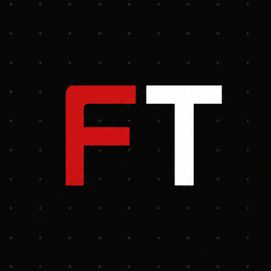

<!-- ============================================================
     FlowThingy / Kranz — GitHub Profile README
     Repo: github.com/FlowThingy/FlowThingy
     Drop your FT logo at: assets/logo.png
     ============================================================ -->

<!-- Animated logo via SVG wrapper — pulse glow in red/dark -->

<!-- Typing SVG — animated typewriter intro -->

<!-- Visitor badge -->

---

## `> whoami`

Student and creator. I learn by building things — not just following tutorials.  
I experiment with software ideas, make videos, edit cars, and ship stuff to the internet.

Currently operating under two names:
- **FlowThingy** — the project/brand. Where experiments go live.
- **Kranz** — the dev/creator behind it.

🌐 **[flowthingy.xyz](https://flowthingy.xyz)**

---

## `> projects`

<b>🔧 FlowThingy Patcher</b> — Python video processing tool

 

A desktop app for processing and preparing videos — built with **Python**, **Tkinter**, and **FFmpeg**.

- Preserves original aspect ratio during processing
- GUI-based workflow, packaged for Windows
- Focused on output for short-form platforms like TikTok

<b>💾 EarthFx OS</b> — experimental Windows XP-inspired interface

 

An experimental software/interface project built around the aesthetic of Windows XP.  
Not a real OS — more of a creative interface exploration.

<b>🧩 NotOgre</b> — browser puzzle/riddle game

 

A browser-based puzzle project inspired by sites like **Notpron** and **Weffriddles**.  
Progress through pages using clues, URL manipulation, and lateral thinking.

Built with plain HTML, CSS, and JavaScript.

<b>🏷️ Metadata Editor</b> — Python media metadata tool

 

A Python project for reading and writing metadata in media files.  
Experimented with fields like comments and making them customizable.

<b>🎬 Video Editing & Creative Projects</b>

 

Regular work in video editing, visual effects, car edits, and short-form content.  

🏆 **1st place** — Mentari sustainability campaign video competition.

---

## `> currently exploring`

<table>
<tr>
<td>

**FlowDesk** &nbsp;

A concept I'm actively exploring — something around making CSV/spreadsheet workflows less painful.

Thinking about: data processing, dashboards, reporting, and turning raw business data into something readable without needing a full enterprise tool.

*Not finished. Not released. Still figuring it out.*

</td>
</tr>
</table>

---

## `> stack`

Things I've actually used across these projects:

---

## `> stats`

&nbsp;

<!-- GitHub Streak Stats -->

---

## `> contribution graph`

<!-- Snake animation — requires GitHub Action (see setup note below) -->

  <picture>
    <source media="(prefers-color-scheme: dark)"
      srcset="https://raw.githubusercontent.com/FlowThingy/FlowThingy/output/github-contribution-grid-snake-dark.svg" />
    <source media="(prefers-color-scheme: light)"
      srcset="https://raw.githubusercontent.com/FlowThingy/FlowThingy/output/github-contribution-grid-snake.svg" />
    
  </picture>

<!-- ──────────────────────────────────────────────────────────────
     SNAKE SETUP (one-time):
     1. In your FlowThingy/FlowThingy repo, create the file:
        .github/workflows/snake.yml  (contents below)
     2. Go to Settings → Actions → General → enable read+write permissions
     3. Run the Action once manually — then it auto-runs daily.

     snake.yml contents:
     ─────────────────────
     name: Generate Snake

     on:
       schedule:
         - cron: "0 0 * * *"
       workflow_dispatch:

     jobs:
       generate:
         runs-on: ubuntu-latest
         steps:
           - uses: Platane/snk@v3
             with:
               github_user_name: FlowThingy
               outputs: |
                 dist/github-contribution-grid-snake.svg
                 dist/github-contribution-grid-snake-dark.svg?palette=github-dark
             env:
               GITHUB_TOKEN: ${{ secrets.GITHUB_TOKEN }}

           - uses: crazy-max/ghaction-github-pages@v3
             with:
               target_branch: output
               build_dir: dist
             env:
               GITHUB_TOKEN: ${{ secrets.GITHUB_TOKEN }}
     ─────────────────────
     ─────────────────────────────────────────────────────────── -->

---

## `> find me`

---

FlowThingy / Kranz · building random things until they work

